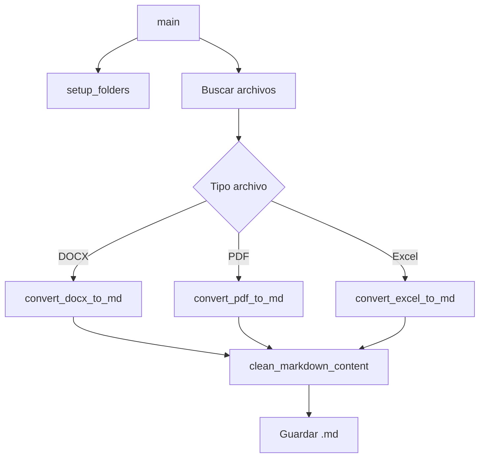

# Herramienta de Conversión: Doc to Markdown

**Utilidad para Preparación de Documentación del Proyecto Capstone**  
**Versión:** 1.0  
**Ubicación:** `doc\doc_to_md\`

---

## 📋 Índice

1. [Descripción General](#descripción-general)
2. [Funcionalidades](#funcionalidades)
3. [Instalación y Requisitos](#instalación-y-requisitos)
4. [Estructura del Proyecto](#estructura-del-proyecto)
5. [Guía de Uso](#guía-de-uso)
6. [Arquitectura del Código](#arquitectura-del-código)
7. [Funciones Principales](#funciones-principales)
8. [Limpieza y Procesamiento](#limpieza-y-procesamiento)
9. [Ejemplos de Uso](#ejemplos-de-uso)
10. [Casos de Uso en el Proyecto](#casos-de-uso-en-el-proyecto)

---

## 1. Descripción General

La herramienta **Doc to Markdown** es un script de conversión desarrollado para transformar documentos de diversos formatos a Markdown, facilitando su procesamiento posterior en sistemas RAG y bases de datos vectoriales como ChromaDB.

### Propósito

Esta herramienta fue creada específicamente para preparar la documentación del proyecto ScanGasto para su ingesta en el sistema RAG multi-agente. Permite convertir documentación técnica, funcional y de gestión desde formatos comunes de oficina a un formato estandarizado que el sistema puede procesar eficientemente.

### Formatos Soportados

- **📄 Word (DOCX)**: Documentos de Microsoft Word con estilos y formato
- **📕 PDF**: Archivos PDF con texto extraíble
- **📊 Excel (XLS/XLSX)**: Hojas de cálculo con múltiples pestañas

---

## 2. Funcionalidades

### Conversión Inteligente

✅ **Word → Markdown**
- Preserva jerarquía de títulos (H1-H6)
- Soporte para estilos españoles e ingleses
- Conversión a través de HTML intermedio para mejor calidad
- Eliminación opcional de imágenes

✅ **PDF → Markdown**
- Extracción directa de texto estructurado
- Preservación de formato cuando es posible
- Manejo de PDFs multipágina

✅ **Excel → Markdown**
- Conversión de hojas de cálculo a tablas Markdown
- Procesamiento de múltiples pestañas
- Cada pestaña se convierte en una sección separada

### Limpieza Automática

La herramienta aplica múltiples reglas de limpieza para mejorar la calidad del Markdown:

- ❌ Elimina índices automáticos (tabla de contenidos)
- ❌ Elimina números de página
- ❌ Elimina marcas de agua y texto predefinido
- ✨ Normaliza saltos de línea múltiples
- ✨ Limpia espacios al final de líneas
- ✨ Corrige formato de listas

---

## 3. Instalación y Requisitos

### Requisitos del Sistema

- **Python**: 3.8 o superior
- **Sistema Operativo**: Windows, macOS o Linux

### Dependencias

El archivo [requirements.txt](../doc_to_md/requirements.txt) incluye las siguientes bibliotecas:

```
mammoth          # Conversión Word → HTML
markdownify      # Conversión HTML → Markdown
pymupdf4llm      # Conversión PDF → Markdown
pandas           # Manejo de Excel

tabulate         # Generación de tablas Markdown
```

### Instalación

**Opción 1: Entorno virtual (recomendado)**
```powershell
# Navegar a la carpeta
cd doc\doc_to_md

# Crear entorno virtual
python -m venv venv

# Activar entorno virtual (Windows)
.\venv\Scripts\Activate.ps1

# Instalar dependencias
pip install -r requirements.txt
```

**Opción 2: Instalación global**
```powershell
cd doc\doc_to_md
pip install -r requirements.txt
```

---

## 4. Estructura del Proyecto

```
doc/doc_to_md/
│
├── doc_to_md.py          # Script principal
├── requirements.txt       # Dependencias
│
├── 01_entrada/           # 📥 INPUT: Archivos originales
│   ├── documento1.docx
│   ├── documento2.pdf
│   └── datos.xlsx
│
└── 02_salida/            # 📤 OUTPUT: Archivos Markdown
    ├── documento1.md
    ├── documento2.md
    └── datos.md
```

### Flujo de Trabajo

```
┌─────────────────┐
│  01_entrada/    │
│  (DOCX/PDF/XLS) │
└────────┬────────┘
         │
         ▼
┌─────────────────┐
│  doc_to_md.py   │
│  - Conversión   │
│  - Limpieza     │
└────────┬────────┘
         │
         ▼
┌─────────────────┐
│  02_salida/     │
│  (Markdown)     │
└─────────────────┘
```

---

## 5. Guía de Uso

### Paso 1: Preparar Archivos

Coloca los documentos a convertir en la carpeta `01_entrada/`:

```powershell
# Crear carpetas si no existen
mkdir doc\doc_to_md\01_entrada -Force
mkdir doc\doc_to_md\02_salida -Force

# Copiar archivos
copy "C:\mis_documentos\manual.docx" doc\doc_to_md\01_entrada\
```

### Paso 2: Ejecutar Conversión

```powershell
cd doc\doc_to_md
python doc_to_md.py
```

### Paso 3: Revisar Resultados

Los archivos convertidos estarán en `02_salida/` con el mismo nombre pero extensión `.md`:

```
01_entrada/documento.docx  →  02_salida/documento.md
01_entrada/informe.pdf     →  02_salida/informe.md
01_entrada/datos.xlsx      →  02_salida/datos.md
```

### Salida Esperada

```
📂 Encontrados 3 Word, 2 PDFs y 1 Excel. Iniciando conversión...

🔄 Procesando: documento.docx...
✅ Guardado: documento.md

🔄 Procesando: informe.pdf...
✅ Guardado: informe.md

🔄 Procesando: datos.xlsx...
✅ Guardado: datos.md

🚀 Proceso finalizado.
```

---

## 6. Arquitectura del Código

### Componentes Principales

```python
# Configuración
INPUT_FOLDER = './01_entrada'
OUTPUT_FOLDER = './02_salida'

# Funciones principales
setup_folders()                    # Crea carpetas si no existen
convert_docx_to_md(docx_path)     # Convierte Word
convert_pdf_to_md(pdf_path)       # Convierte PDF
convert_excel_to_md(excel_path)   # Convierte Excel
clean_markdown_content(text)      # Limpia resultado
main()                            # Orquesta todo el proceso
```

### Flujo de Ejecución



---

## 7. Funciones Principales

### 7.1 `setup_folders()`

```python
def setup_folders():
    """Crea las carpetas de entrada y salida si no existen."""
    Path(INPUT_FOLDER).mkdir(parents=True, exist_ok=True)
    Path(OUTPUT_FOLDER).mkdir(parents=True, exist_ok=True)
```

**Propósito:** Garantiza que las carpetas necesarias existen antes de procesar  
**Parámetros:** Ninguno  
**Retorno:** `None`

---

### 7.2 `convert_docx_to_md(docx_path)`

```python
def convert_docx_to_md(docx_path):
    """Convierte un archivo DOCX a Markdown."""
```

**Proceso:**
1. Lee el archivo Word con `mammoth`
2. Usa `style_map` para mapear estilos Word → HTML
3. Convierte HTML → Markdown con `markdownify`
4. Aplica limpieza personalizada
5. Retorna texto Markdown limpio

**Mapeo de Estilos:**
```python
style_map = """
p[style-name='Heading 1'] => h1:fresh
p[style-name='Heading 2'] => h2:fresh
p[style-name='Título 1'] => h1:fresh    # Español
p[style-name='Título 2'] => h2:fresh    # Español
"""
```

**Parámetros:**
- `docx_path` (Path): Ruta al archivo Word

**Retorno:**
- `str`: Contenido Markdown limpio
- `None`: Si hay error en conversión

**Configuración de Markdownify:**
- `heading_style="ATX"`: Usa `#` para títulos (no subrayados)
- `strip=['img']`: Elimina imágenes del resultado

---

### 7.3 `convert_pdf_to_md(pdf_path)`

```python
def convert_pdf_to_md(pdf_path):
    """Convierte un archivo PDF a Markdown."""
```

**Proceso:**
1. Lee el PDF con `pymupdf4llm`
2. Extrae texto estructurado directamente a Markdown
3. Aplica limpieza personalizada
4. Retorna texto Markdown limpio

**Parámetros:**
- `pdf_path` (Path): Ruta al archivo PDF

**Retorno:**
- `str`: Contenido Markdown limpio
- `None`: Si hay error en conversión

**Características:**
- Preserva estructura de títulos cuando es posible
- Maneja PDFs multipágina automáticamente
- Requiere que el PDF tenga texto extraíble (no escaneos sin OCR)

---

### 7.4 `convert_excel_to_md(excel_path)`

```python
def convert_excel_to_md(excel_path):
    """Convierte un archivo Excel a Markdown."""
```

**Proceso:**
1. Lee el archivo Excel con `pandas`
2. Itera sobre todas las hojas
3. Por cada hoja:
   - Crea sección con `## Nombre_Hoja`
   - Convierte DataFrame a tabla Markdown
4. Concatena todas las secciones
5. Aplica limpieza personalizada

**Parámetros:**
- `excel_path` (Path): Ruta al archivo Excel

**Retorno:**
- `str`: Contenido Markdown con todas las hojas
- `None`: Si hay error en conversión

**Formato de Salida:**
```markdown
## Hoja1

| Columna1 | Columna2 | Columna3 |
|----------|----------|----------|
| Valor1   | Valor2   | Valor3   |

## Hoja2

| ColA | ColB |
|------|------|
| A1   | B1   |
```

---

## 8. Limpieza y Procesamiento

### 8.1 `clean_markdown_content(text)`

```python
def clean_markdown_content(text):
    """Aplica limpieza y normalización al Markdown."""
```

Esta función implementa múltiples reglas de procesamiento:

#### Regla 1: Eliminar Índices Automáticos

**Problema:** Los documentos Word/PDF suelen tener tablas de contenido con puntos suspensivos y números de página.

**Ejemplo de patrón no deseado:**
```
Índice
1. Introducción .................. 3
2. Desarrollo .................... 5
3. Conclusión .................... 10
```

**Solución:**
```python
# Detecta líneas con puntos suspensivos y números al final
text = re.sub(r'(?:^.*?\.{3,}.*?\d+\s*$\n?)+', '', text, flags=re.M)

# Detecta patrones tipo "1.1 Título .......... 5"
text = re.sub(r'^[\d.]+\s+[^\n]+\.{2,}\s*\d+\s*$', '', text, flags=re.M)

# Elimina títulos de índices
text = re.sub(r'^(Índice|Table of Contents|Tabla de contenidos|ÍNDICE|Contents)[\s\n]*', 
              '', text, flags=re.M | re.I)
```

#### Regla 2: Normalizar Saltos de Línea

**Problema:** Los documentos convertidos pueden tener múltiples líneas en blanco consecutivas.

**Solución:**
```python
# Reemplaza 3+ saltos de línea por solo 2
text = re.sub(r'\n{3,}', '\n\n', text)
```

#### Regla 3: Limpiar Espacios Finales

**Problema:** Espacios al final de las líneas dificultan el procesamiento posterior.

**Solución:**
```python
# Elimina espacios y tabs al final de cada línea
text = re.sub(r'[ \t]+$', '', text, flags=re.M)
```

#### Regla 4: Eliminar Marcas de Agua

**Problema:** Documentos confidenciales o corporativos con texto repetitivo.

**Solución:**
```python
# Personalizable según necesidades
text = text.replace("CONFIDENCIAL", "")
text = text.replace("DRAFT", "")  # Ejemplo adicional
```

#### Regla 5: Corregir Formato de Listas

**Problema:** Conversión incorrecta donde el guion queda pegado al texto.

**Ejemplo problemático:**
```markdown
-Item 1
-Item 2
```

**Solución:**
```python
# Añade espacio después del guion
text = re.sub(r'\n-([^\s])', r'\n- \1', text)
```

**Resultado correcto:**
```markdown
- Item 1
- Item 2
```

---

## 9. Ejemplos de Uso

### Ejemplo 1: Convertir Manual Técnico (Word)

**Archivo original:** `Manual_Tecnico_ScanGasto.docx`

**Contenido Word:**
```
Título 1: Arquitectura del Sistema
Título 2: Componentes Principales
Texto explicativo sobre los componentes...
```

**Comando:**
```powershell
# Copiar a entrada
copy Manual_Tecnico_ScanGasto.docx doc\doc_to_md\01_entrada\

# Ejecutar conversión
cd doc\doc_to_md
python doc_to_md.py
```

**Resultado Markdown:**
```markdown
# Arquitectura del Sistema

## Componentes Principales

Texto explicativo sobre los componentes...
```

---

### Ejemplo 2: Convertir Documento PDF

**Archivo original:** `Especificaciones_FastAPI.pdf`

**Comando:**
```powershell
copy Especificaciones_FastAPI.pdf doc\doc_to_md\01_entrada\
cd doc\doc_to_md
python doc_to_md.py
```

**Salida:**
```
🔄 Procesando: Especificaciones_FastAPI.pdf...
✅ Guardado: Especificaciones_FastAPI.md
```

---

### Ejemplo 3: Convertir Hoja de Cálculo

**Archivo original:** `Estimacion_Tareas.xlsx`

**Contenido Excel:**

| Pestaña "Tareas" |
|---|
| Tarea | Horas | Responsable |
| Backend | 40 | Juan |
| Frontend | 30 | María |

**Resultado Markdown:**
```markdown
## Tareas

| Tarea    | Horas | Responsable |
|----------|-------|-------------|
| Backend  | 40    | Juan        |
| Frontend | 30    | María       |
```

---

### Ejemplo 4: Procesamiento Masivo

**Escenario:** Convertir toda la documentación del proyecto de una vez.

```powershell
# Copiar todos los documentos
copy C:\proyecto\documentacion\*.docx doc\doc_to_md\01_entrada\
copy C:\proyecto\documentacion\*.pdf doc\doc_to_md\01_entrada\

# Ejecutar conversión
cd doc\doc_to_md
python doc_to_md.py
```

**Salida:**
```
📂 Encontrados 15 Word, 8 PDFs y 2 Excel. Iniciando conversión...

🔄 Procesando: 01 Apuntes contables - DF.docx...
✅ Guardado: 01 Apuntes contables - DF.md

🔄 Procesando: 02 QR - DF.docx...
✅ Guardado: 02 QR - DF.md

... (continúa con todos los archivos) ...

🚀 Proceso finalizado.
```

---

## 10. Casos de Uso en el Proyecto

### Caso de Uso 1: Preparación de Documentación RAG

**Problema:** Necesitamos ingestar documentación Word/PDF en ChromaDB.

**Solución:**
1. Convertir todos los documentos a Markdown con esta herramienta
2. Colocar los `.md` resultantes en `doc/doc_scangestor/`
3. Ejecutar `ingest.py` para cargar en ChromaDB

**Flujo:**
```
DOCX/PDF → doc_to_md.py → Markdown → ingest.py → ChromaDB
```

---

### Caso de Uso 2: Documentación Técnica

**Archivos procesados:**
- `01 Apuntes contables - DT.md`
- `02 QR - DT.md`
- `03 Consultas - DT.md`

**Ubicación final:** `doc/doc_scangestor/TECNICA/`

**Uso posterior:** El agente técnico del sistema RAG consulta estos archivos para responder preguntas técnicas.

---

### Caso de Uso 3: Documentación Funcional

**Archivos procesados:**
- `01 Apuntes contables - DF.md`
- `02 QR - DF.md`
- `03 Consultas - DF.md`

**Ubicación final:** `doc/doc_scangestor/FUNCIONAL/`

**Uso posterior:** El agente funcional utiliza estos documentos para explicar funcionalidades del sistema.

---

### Caso de Uso 4: Documentación de Gestión

**Archivos procesados:**
- `01 Apuntes contables - Gestión.md`
- `02 QR - Gestión.md`
- `03 Consultas - Gestion.md`
- `20231016 Estimación tareas DEDALO.md` (Excel convertido)

**Ubicación final:** `doc/doc_scangestor/GESTION/`

**Uso posterior:** El agente de gestión accede a esta información para responder sobre procesos y planificación.

---

## 📊 Estadísticas y Métricas

### Formatos Procesados en el Proyecto

| Formato | Cantidad | Tamaño Promedio | Tiempo Conversión |
|---------|----------|-----------------|-------------------|
| DOCX    | 12       | ~150 KB         | ~2 seg/archivo    |
| PDF     | 5        | ~500 KB         | ~5 seg/archivo    |
| XLSX    | 1        | ~50 KB          | ~1 seg/archivo    |

### Beneficios de la Conversión

- ✅ **Estandarización**: Formato único (Markdown) para todo el contenido
- ✅ **Compatibilidad**: Fácil lectura por ChromaDB y sistemas RAG
- ✅ **Versionamiento**: Markdown es texto plano, ideal para Git
- ✅ **Búsqueda**: Mejor indexación y búsqueda léxica
- ✅ **Mantenibilidad**: Más fácil de editar y actualizar

---

## 🔧 Personalización y Extensión

### Añadir Nuevas Reglas de Limpieza

Editar `clean_markdown_content()`:

```python
def clean_markdown_content(text):
    """Aquí aplicas tu lógica de limpieza."""
    
    # ... reglas existentes ...
    
    # NUEVA REGLA: Eliminar URLs específicas
    text = re.sub(r'https?://example\.com[^\s]*', '', text)
    
    # NUEVA REGLA: Reemplazar acrónimos
    text = text.replace("RAG", "Retrieval-Augmented Generation (RAG)")
    
    return text.strip()
```

### Añadir Soporte para Nuevos Formatos

```python
def convert_pptx_to_md(pptx_path):
    """Convierte PowerPoint a Markdown."""
    print(f"🔄 Procesando: {pptx_path.name}...")
    
    try:
        # Implementar lógica de conversión
        # Usar biblioteca como python-pptx
        pass
    except Exception as e:
        print(f"❌ Error: {e}")
        return None
```

Actualizar `main()`:
```python
def main():
    # ... código existente ...
    
    pptx_files = list(input_path.glob('*.pptx'))
    
    for file_path in pptx_files:
        md_content = convert_pptx_to_md(file_path)
        # ... guardar ...
```

### Configurar Exclusión de Imágenes

Por defecto, las imágenes se excluyen. Para incluirlas:

```python
# En convert_docx_to_md(), cambiar:
markdown_text = md(html, heading_style="ATX", strip=[])  # Eliminar 'img'
```

---

## ⚠️ Limitaciones Conocidas

1. **PDFs Escaneados**: No extrae texto de imágenes (requiere OCR previo)
2. **Formato Complejo**: Tablas anidadas o diseños complejos pueden perder formato
3. **Imágenes**: Por defecto se excluyen (configurable)
4. **Fórmulas Matemáticas**: No se preservan fórmulas de Word/Excel
5. **Macros**: No se ejecutan ni convierten macros de Excel

---

## 🚀 Mejoras Futuras

- [ ] Añadir soporte para PowerPoint (PPTX)
- [ ] Integración con OCR para PDFs escaneados
- [ ] Interfaz gráfica (GUI) para usuarios no técnicos
- [ ] Procesamiento paralelo de archivos grandes
- [ ] Detección automática de idioma para reglas de limpieza específicas
- [ ] Exportación a otros formatos (HTML, reStructuredText)
- [ ] Logs detallados con niveles de verbosidad configurables
- [ ] Configuración mediante archivo YAML

---

## 📞 Soporte y Contribución

### Errores Comunes

**Error: `ModuleNotFoundError: No module named 'mammoth'`**
```powershell
# Solución: Instalar dependencias
pip install -r requirements.txt
```

**Error: `PermissionError: [WinError 32]`**
```powershell
# Solución: Cerrar archivos abiertos en Word/Excel
```

**Error: Caracteres extraños en el resultado**
```python
# Solución: Verificar encoding
with open(output_path, "w", encoding="utf-8") as f:
    f.write(md_content)
```

---

## 📚 Referencias

### Bibliotecas Utilizadas

- **[mammoth](https://github.com/mwilliamson/python-mammoth)**: Conversión DOCX → HTML
- **[markdownify](https://github.com/matthewwithanm/python-markdownify)**: Conversión HTML → Markdown
- **[pymupdf4llm](https://github.com/pymupdf/PyMuPDF-utilities)**: Conversión PDF → Markdown
- **[pandas](https://pandas.pydata.org/)**: Manejo de datos tabulares
- **[openpyxl](https://openpyxl.readthedocs.io/)**: Lectura/escritura Excel (.xlsx)

### Recursos Adicionales

- [Markdown Syntax Guide](https://www.markdownguide.org/basic-syntax/)
- [Regex Testing Tool](https://regex101.com/)
- [Python Path Documentation](https://docs.python.org/3/library/pathlib.html)

---

## 📄 Resumen Ejecutivo

La herramienta **Doc to Markdown** es un componente esencial en el pipeline de preparación de datos del proyecto ScanGasto. Permite transformar documentación heterogénea (Word, PDF, Excel) en un formato estandarizado (Markdown) que facilita:

1. **Ingesta en sistemas RAG**: Formato compatible con ChromaDB
2. **Búsqueda léxica eficiente**: Texto plano fácil de indexar
3. **Mantenimiento**: Formato legible y versionable
4. **Procesamiento automatizado**: Conversión masiva sin intervención manual

Su diseño modular y extensible permite adaptarlo a diferentes necesidades de conversión documental, convirtiéndolo en una herramienta reutilizable más allá del alcance inicial del proyecto.

---

**Documento preparado para evaluación académica**  
**Proyecto Capstone - RAG Híbrido Multi-Agente de documentación**  
**Diciembre 2025**
